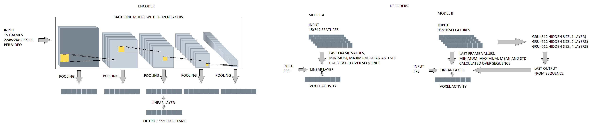

# The Algonauts Project 2021
## How the Human Brain Makes Sense of a World in Motion

  
   (source: http://algonauts.csail.mit.edu/challenge.html)

Code for the Algonauts Project 2021 (http://algonauts.csail.mit.edu/). The goal was to predict brain responses recorded while participants viewed short video clips of everyday events. The project had two pars:
- Mini Track: predict brain responses in specific regions of interest (ROIs) of the brain that are known to play a key role in visual perception (V1, V2, V3, V4, LOC, EBA, FFA, STS, PPA)
- Full Track: predict brain responses across the whole brain (for the provided set of reliable voxels)

This solutions ranked 9th in the Mini Track and 5th in Full Track.

## Description
Data preprocessing: 
- Videos resampled to 5 FPS and resided to 224*224 pixels
- Random number of frames skipped before resampling
- Augmentations: Shift Scale Rotate, Random Perspective change, Coarse Dropout, Random Brightness

Training:
- Generate all possible combinations from the 3 provided repetitions resulting into 7 samples for each video per participant
- First 900 videos from the training dataset were used for training and last 100 for validation
- Loss functions: Weighed Mean Square Error

Models:
- Model A: eca_nfnet_l0 backbone; pooling: maximum, average; stats over sequence
- Model B: resnet50; pooling: maximum, average, Linear layers; stats over sequence and RNNs

## Notebooks and report

Training and submission notebooks: 
Mini Track: [src/notebook/vid2fmri-minitrack.ipynb](/src/notebook/vid2fmri-minitrack.ipynb) 
Full Track: [src/notebook/vid2fmri-fulltrack.ipynb](/src/notebook/vid2fmri-fulltrack.ipynb) 

EDA notebook: [src/notebook/vid2fmri-eda.ipynb](/src/notebook/vid2fmri-eda.ipynb) ([nbviewer](https://nbviewer.jupyter.org/github/michal-nahlik/algonauts-vid2fmri-2021/blob/master/src/notebook/vid2fmri-eda.ipynb)) 

Report: [doc/algonauts-vid2fmri-2021.pdf](/doc/algonauts-vid2fmri-2021.pdf) 

## Results
|Mini Track|Score|LOC|FFA|STS|EBA|PPA|V1|V2|V3|V4|
|---|:---:|:---:|:---:|:---:|:---:|:---:|:---:|:---:|:---:|:---:|
|Baseline|0.420|0.439|0.504|0.332|0.444|0.348|0.444|0.434|0.405|0.428|
|A+B ensemble|0.571|0.647|0.707|0.484|0.647|0.550|0.499|0.502|0.522|0.580|

|Full Track|Score|
|---|:---:|
|Baseline|0.206|
|A+B ensemble|0.312|

## TODO:
- try differenet pooling methods (pool 2, 3, ... values)
- check how different pooling methods affect score for different ROIs
- visualize feature/pooling importance for each ROI
- write report / article